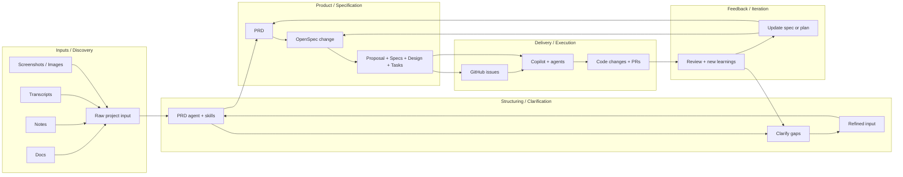

# Yugastore in Java


This is an implementation of a sample ecommerce app. This microservices-based retail marketplace or eCommerce app is composed of **microservices written in Spring (Java)**, a **UI based on React** and **YugabyteDB as the [distributed SQL](https://www.yugabyte.com/tech/distributed-sql/) database**.

If you're using this demo app, please :star: this repository! We appreciate your support.

## Trying it out

This repo contains all the instructions you need to [run the app on your laptop](#building-the-app).

You can also [try the app out](https://yugastore-ui.cfapps.io/) online, it is hosted on [Pivotal Web Services](https://run.pivotal.io/).

# Versions

* Java 17
* Spring Boot 2.6.3
* Spring Cloud 2021.0.0
* Yugabyte Java Driver 4.6.0-yb-10
* Python 3 (Data Loading)

# Features

* Written fully in Spring Framework
* Desgined for multi-region and Kubernetes-native deployments
* Features 6 Spring Boot microservices
* Uses a discovery service that the microservices register with
* Sample data has over 6K products in the store

## Architecture

The architecture diagram of Yugastore is shown below.


## AI Delivery Workflow

This repository uses a lightweight AI-driven delivery workflow that turns raw source material into structured execution artifacts before implementation begins.




| Microservice         | YugabyteDB API | Default host:port | Description           |
| -------------------- | ---------------- | ---------------- | --------------------- |
| [service discovery](https://github.com/yugabyte/yugastore-java/tree/master/eureka-server-local) | - | [localhost:8761](http://localhost:8761) | Uses **Eureka** for localhost. All microservices register with the Eureka service. This registration information is used to discover dynamic properties of any microservice. Examples of discovery include finding the hostnames or ip addresses, the load balancer and the port on which the microservice is currently running.
| [react-ui](https://github.com/yugabyte/yugastore-java/tree/master/react-ui) | - | [localhost:8080](http://localhost:8080) | A react-based UI for the eCommerce online marketplace app.
| [api-gateway](https://github.com/yugabyte/yugastore-java/tree/master/api-gateway-microservice) | - | [localhost:8081](http://localhost:8081) | This microservice handles all the external API requests. The UI only communicates with this microservice.
| [products](https://github.com/yugabyte/yugastore-java/tree/master/products-microservice) | YCQL | [localhost:8082](http://localhost:8082) | This microservice contains the entire product catalog. It can list products by categories, return the most popular products as measured by sales rank, etc.
| [cart](https://github.com/yugabyte/yugastore-java/tree/master/cart-microservice) | YSQL | [localhost:8083](http://localhost:8083) | This microservice deals with users adding items to the shopping cart. It has to be necessarily highly available, low latency and often multi-region.
| [checkout](https://github.com/yugabyte/yugastore-java/tree/master/checkout-microservice) | YCQL | [localhost:8086](http://localhost:8086) | This deals with the checkout process and the placed order. It also manages the inventory of all the products because it needs to ensure the product the user is about to order is still in stock.
| [login](https://github.com/yugabyte/yugastore-java/tree/master/login-microservice) | YSQL | [localhost:8085](http://localhost:8085) | Handles login and authentication of the users. *Note that this is still a work in progress.*

# Build and run

To build, simply run the following from the base directory:

```
$ mvn -DskipTests package
```

To run the app locally, you need a YugabyteDB instance, the required schemas, the sample data, and then each of the microservices followed by the React UI.

## Running the app on host

Make sure you have built the app as described above. Now do the following steps.

## Step 1: Install and initialize YugabyteDB

You can [install YugabyteDB by following these instructions](https://docs.yugabyte.com/latest/quick-start/).

If you prefer to avoid a host install, you can run a single-node YugabyteDB container instead:

```
$ docker run -d --name yugastore-yb \
	-p 7000:7000 -p 9000:9000 -p 9042:9042 -p 5433:5433 -p 15433:15433 \
	yugabytedb/yugabyte:latest \
	bin/yugabyted start --daemon=false
```

Once the container is up, the admin UI is available at [http://localhost:7000/](http://localhost:7000/).

Now create the necessary tables as shown below. Note that these steps would take a few seconds.

```
$ cd resources
$ cqlsh -f schema.cql
```

If you are using Docker for YugabyteDB, initialize both the YCQL and YSQL schemas from the repo root as follows:

```
$ docker exec -i yugastore-yb ycqlsh -f - < resources/schema.cql
$ docker exec -i yugastore-yb ysqlsh -h 127.0.0.1 -p 5433 -f - < resources/schema.sql
```

From the repo root, you can also open the local YCQL shell with:

```
$ ./ycqlsh.sh
```

This defaults to `127.0.0.1:9042` and the `cronos` keyspace, and accepts extra `ycqlsh` arguments such as `-e "DESCRIBE TABLES;"`.

With the Docker-based setup, you can open a shell inside the container instead:

```
$ docker exec -it yugastore-yb ycqlsh 127.0.0.1 9042 -k cronos
```

Next, load some sample data. If you installed YugabyteDB directly on the host, the legacy loader script is:

```
$ cd resources
$ ./dataload.sh
```

For current YugabyteDB Docker images, the more reliable path is to load the checked-in CSV files with `COPY` instead of the legacy `cassandra-loader` script.

Copy the seed files into the container:

```
$ docker cp resources/cronos_products.csv yugastore-yb:/tmp/cronos_products.csv
$ docker cp resources/cronos_product_rankings.csv yugastore-yb:/tmp/cronos_product_rankings.csv
$ docker cp resources/cronos_product_inventory.csv yugastore-yb:/tmp/cronos_product_inventory.csv
```

Then seed the YCQL tables:

```
$ docker exec yugastore-yb ycqlsh 127.0.0.1 9042 -k cronos -e "COPY products (asin, title, description, price, imurl, also_bought, also_viewed, bought_together, buy_after_viewing, brand, categories, num_reviews, num_stars, avg_stars) FROM '/tmp/cronos_products.csv';"
$ docker exec yugastore-yb ycqlsh 127.0.0.1 9042 -k cronos -e "COPY product_rankings (asin, category, sales_rank, title, price, imurl, num_reviews, num_stars, avg_stars) FROM '/tmp/cronos_product_rankings.csv';"
$ docker exec yugastore-yb ycqlsh 127.0.0.1 9042 -k cronos -e "COPY product_inventory (asin, quantity) FROM '/tmp/cronos_product_inventory.csv';"
```

You can verify that the seed completed by running a few sample queries:

```
$ docker exec yugastore-yb ycqlsh 127.0.0.1 9042 -k cronos -e "SELECT asin, title, price FROM products LIMIT 5;"
$ docker exec yugastore-yb ycqlsh 127.0.0.1 9042 -k cronos -e "SELECT * FROM product_rankings WHERE asin = '0000031909';"
$ docker exec yugastore-yb sh -lc "ip=\$(hostname -i | awk '{print \$1}'); ycqlsh \"\$ip\" 9042 -k cronos -e \"SELECT * FROM product_rankings WHERE category = 'Toys & Games' LIMIT 10;\""
$ docker exec yugastore-yb ysqlsh -h 127.0.0.1 -p 5433 -c "SELECT * FROM shopping_cart LIMIT 5;"
```

If you are using the Docker workflow above, the `ysqlsh` command already creates the YSQL tables defined in `resources/schema.sql`.

## Step 2: Start the Eureka service discovery (local)

You can do this as follows:

```
$ cd eureka-server-local/
$ mvn spring-boot:run
```

Verify this is running by browsing to the [Spring Eureka Service Discovery dashboard](http://localhost:8761/).

## Step 2: Start the api gateway microservice

To run the products microservice, do the following in a separate shell:

```
$ cd api-gateway-microservice/
$ mvn spring-boot:run
```


## Step 3: Start the products microservice

To run the products microservice, do the following in a separate shell:

```
$ cd products-microservice/
$ mvn spring-boot:run
```

## Step 4: Start the checkout microservice

To run the products microservice, do the following in a separate shell:

```
$ cd checkout-microservice/
$ mvn spring-boot:run
```

## Step 5: Start the checkout microservice

To run the cart microservice, do the following in a separate shell:

```
$ cd cart-microservice/
$ mvn spring-boot:run
```

## Step 6: Start the UI

To do this, simply run `npm start` from the `frontend` directory in a separate shell:

```
$ cd react-ui
$ mvn spring-boot:run
```

Now browse to the marketplace app at [http://localhost:8080/](http://localhost:8080/).

# Running the app in docker containers

The dockers images are built along with the binaries when `mvn -DskipTests package` was run.
To run the docker containers, run the following script after you have initialized YugabyteDB as described in [Step 1](#step-1-install-and-initialize-yugabyte-db):

```
$ ./docker-run.sh
```
Check all the services are registered on the [eureka-server](http://127.0.0.1:8761/).
Once all services are registered, you can browse the marketplace app at [http://localhost:8080/](http://localhost:8080/).


## Screenshots


### Home


### Product Category Page


### Product Detail Page


### Car


## Checkout


